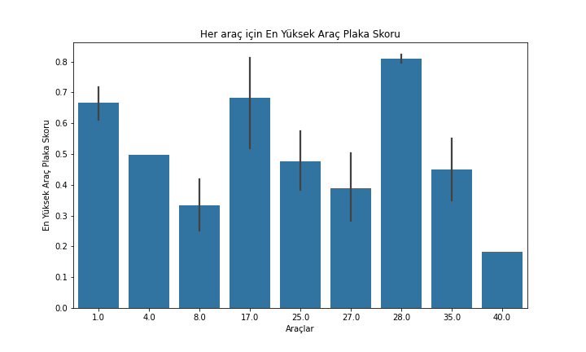

# Plaka Okuma ve Yönetimi
Python tabanlı otomatik plaka tanıma ve güvenlik yönetim sistemi, plaka okuma ve yönetimini etkili bir şekilde optimize etmeyi hedefler. Proje, [YOLOv8](https://github.com/ultralytics/ultralytics)
 ve [OpenCV](https://github.com/opencv/opencv) gibi güçlü kütüphaneleri kullanarak makine öğrenimi ve görüntü işleme teknikleriyle entegre edilmiş bir plaka tanıma algoritması sunar. Bu algoritma, plakalardaki karakterleri başarıyla tanıma yeteneğini kanıtlamıştır.

Veri tabanı yönetimi, araç plakalarına ait bilgilerin depolandığı bir sistem içerir ve bu bilgiler web tabanlı bir sorgulama sistemi aracılığıyla kullanıcılara erişilebilir hale getirilmiştir. Bu, kullanıcı dostu arayüz ve pratik sorgulama özellikleriyle projenin etkileşimini artırır. Proje, plaka okuma teknolojisinin sadece trafik yönetimi değil, aynı zamanda şehir içi ve otopark güvenliği gibi geniş alanlarda da kullanılmasını amaçlar. Bu, günlük yaşantıdaki güvenlik önlemlerini artırarak toplumda pratik bir uygulanabilirlik sunar. Ayrıca, projenin öne çıkan özelliklerinden biri, geleneksel plaka tanıma sistemlerinden farklılaşan video tabanlı plaka tanıma ve veri tabanına kayıt süreçlerine odaklanmasıdır. Bu yaklaşım, plakaların çerçeve, harf ve rakam içeren özel bir veri seti kullanarak etkili bir performans elde etmeyi amaçlar.

Sonuç olarak, Python tabanlı bu proje, güvenlik izleme özellikleri ve video tabanlı plaka tanıma sistemiyle günlük yaşantıdaki güvenlik önlemlerini artırmayı amaçlayan kapsamlı bir çözüm sunar. Hem teknik başarı hem de kullanıcı dostu arayüzü ile projenin etkili bir şekilde uygulanabilir olduğu görülmektedir.

## Projenin Gereç ve Yöntemleri
### Yazılım ve Donanım Araçları
Python programlama dilinde geliştirilen otomatik plaka tanıma algoritması, [YOLOv8](https://github.com/ultralytics/ultralytics) ve [OpenCV](https://github.com/opencv/opencv) gibi güçlü kütüphaneleri içermektedir. Ayrıca, veri tabanı yönetimi için MySQL ve web tabanlı sorgulama sistemi için PHP dili kullanılmıştır.

Proje kapsamında kullanılan donanım bileşenleri arasında iyi çözünürlüklü kamera sistemleri ve bilgisayarlar bulunmaktadır.

### Modelin Eğitiminde Kullanılan Veri Setinin Hazırlanması
**Veri Kümesi Oluşturma:** İlk aşama olarak, projenin temelini oluşturan veri kümesini elde etmek için plaka içeren araç görselleri toplandı. Bu süreç, projenin başarısı için kritik öneme sahiptir. Veri kümesi, özenle seçilmiş ve plakaların doğru bir şekilde etiketlenmesi için detaylı bir incelemeye tabi tutulmuştur. Ayrıca, elde edilen veri kümesi kategorize edilmiş ve düzenlenmiştir. İlk aşamada kullanılan veri kümesinin yeterli olmaması durumunda, Kaggle gibi platformlardan daha geniş bir veri seti araştırıldı sonrasında daha büyük bir veri seti ile devam edilmiştir. Bu yeni veri seti, modelin eğitiminde daha fazla çeşitlilik sağlamıştır.

**Veri Seti İşleme ve Etiketleme:** Elde edilen veri seti üzerinde çeşitli ön işleme adımları uygulanmıştır. Bu adımlar arasında boyutlandırma, kontrast ayarlama ve gürültü azaltma gibi işlemler yer almaktadır. Bu işlemler, modelin daha tutarlı ve güvenilir öğrenmeler yapabilmesi için gereklidir.

**Plaka Belirleme Çerçeveleri:** Modelin eğitimi için her bir veri seti öğesinde plakalar, dikdörtgen çerçevelerle belirlenmiştir. Bu adım, modelin plakaları doğru bir şekilde tanıyabilmesi için gerekli olan öğrenme verilerini sağlamaktadır.

<!-- Ara -->

## Test Videosu
Test videosunu oluştururken, görüntü netliği, hava durumu, ışık farkı ve çerçeve hızı gibi faktörlere özellikle dikkat ettik. Bu önemli konuları göz önünde bulundurarak oluşturduğumuz test videosunu kullanarak, modelimizin ve algoritmamızın performansını değerlendiriyoruz.

## Algoritmanın Geliştirilmesi
Algoritmamız, makine öğrenimi ve görüntü işleme tekniklerini içeren [YOLOv8](https://github.com/ultralytics/ultralytics) ve [EasyOCR](https://github.com/jaidedai/easyocr) gibi önemli araçlardan yararlanmakta makine öğrenimi ve görüntü işleme tekniklerini kullanmaktadır. Bu süreçte, algoritmanın çıktılarını düzenlemek, işlemek ve analiz etmek için [Pandas](https://pandas.pydata.org/), [Numpy](https://numpy.org/) ve [Matplotlib](https://matplotlib.org/) kütüphaneleri de kullanılmaktadır.

Oluşturulan model, projede kullanılacak olan videolar üzerinde test edilecektir. Test sonuçları, algoritmanın okuduğu değerlere atama yaparak çeşitli değişkenleri içerecektir. Bu değişkenler arasında id, araç id, plakanın tanıma skoru, plakanın okuma skoru, ve okunan plaka gibi bilgiler yer alacaktır. Elde edilen sonuç değerleri daha sonra bir ".csv" uzantılı dosyaya Pandas ve Numpy kullanılarak kaydedilerek, algoritmanın performansıyla ilgili detaylı bir rapor oluşturulacaktır.

## Veri Tabanı Yönetimi ve Web Tabanlı Sorgulama Sistemi
Araçlara ait plaka bilgilerinin güvenli bir şekilde depolandığı [MySQL](https://www.mysql.com/) tabanlı bir veri tabanı yönetimi kullanılmıştır. Ayrıca, kullanıcıların araç varlığını sorgulayabilecekleri kullanıcı dostu bir web tabanlı arayüz [Bootstrap](https://getbootstrap.com/) ve [PHP](https://www.php.net/) ile oluşturulmuştur.

## Test ve Doğrulama
Geliştirilen algoritma ve sistem, farklı videolarda gerçekleştirilen testlerle doğrulanmıştır. Doğruluk oranları, hız performansı üzerinde detaylı testler uygulanmıştır. Diğer Modellerle karşılaştırılmıştır ve sonuçlar Matplotlib kullanılarak grafik haline getirilmiştir.

## CSV Dosyası ve Veritabanı Yapısı
test.csv adlı CSV dosyasında her karenin detayları bulunmaktadır. Bu veriler, araç ve plaka bilgilerini içermektedir. Bu veriler daha sonra tablolar ve plakalar adlı iki tabloya aktarılmaktadır.
 

<h3 style="text-align:center;">İletişim</h3>

   <a href="mailto:plakaafili@gmail.com" target="_blank">E-posta Adresimiz</a>

<h3 style="text-align:center;">Web Sitesi</h3>

   Projeyi <a href="https://recepemreors.com.tr/index.php">sitemizden</a> inceleyebilirsiniz.

<h3 style="text-align:center;">Hazırlayanlar</h3>

   Recep Emre ÖRS · Serhat KADAK · Melike BEKTAŞ · Berke ÖZDEMİR

## Lisans
Bu proje, [MIT lisansı](LICENSE) altında lisanslanmıştır.
